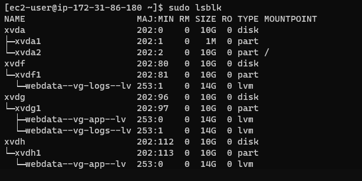
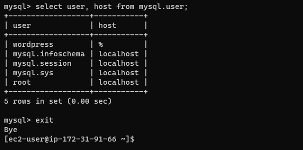
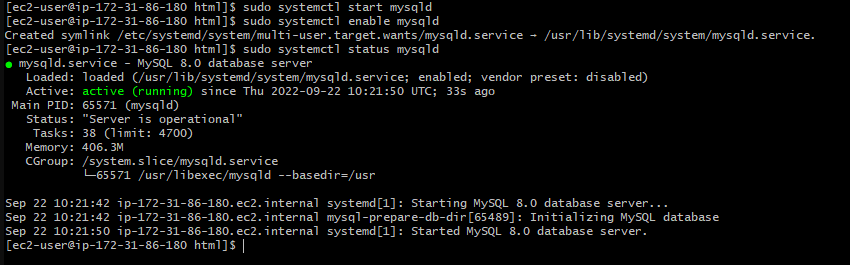
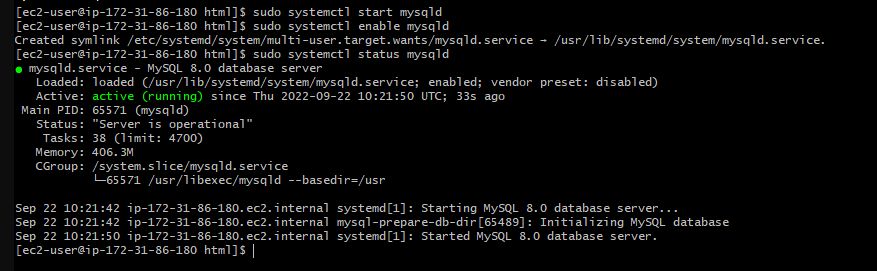
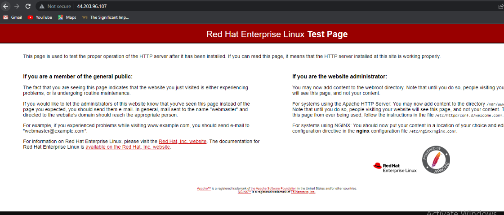
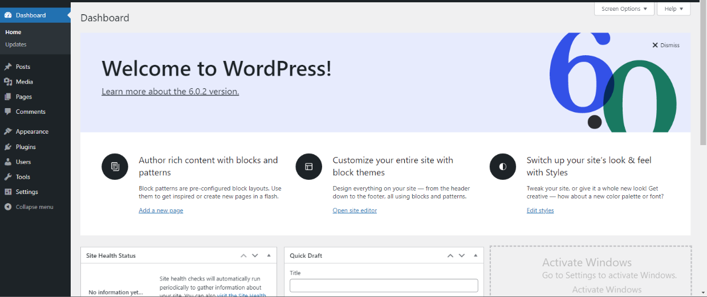

# PECTOR DOCUMENTION FOR PROJECT 6
- Here, I was asked to prepare storage infrastructure on two Linux servers and implement a basic web solution using WordPress. As shown in the documentation, we have a Three-tier Architecture which is a client-server software architecture pattern that comprise of 3 separate layers (Presentation Layer (PL)), (Business Layer (BL)) and (Data Access or Management Layer (DAL)) which we also have in 3-Tier Setup
- A Laptop or PC to serve as a client
- An EC2 Linux Server as a web server (This is where you will install WordPress)
- An EC2 Linux server as a database (DB) server.
Volumes for 2 servers were created
, I then created a linux terminal for instance
, to create my partition, I ran `lsblk` .
I used  pvcreate utility to mark each of 3 disks as physical volumes (PVs) to be used by LVM `sudo pvcreate /dev/xvdf1` `sudo pvcreate /dev/xvdg1` `sudo pvcreate /dev/xvdh1`  thereafter create the volume group with the command `sudo vgcreate webdata-vg /dev/xvdh1 /dev/xvdg1 /dev/xvdf1` , logical volume was created and running , 
, I ran `sudo mkfs -t ext4 /dev/webdata-vg/app-lv and sudo mkfs -t ext4 /dev/webdata-vg/logs-l` 
 I used `sudo mkdir -p /var/www/html` to create a directory in other to store the websites files and `sudo mkdir -p /home/recovery/logs` to store backup of log `/var/www/html/` was mounted on `app-lv` with `sudo mount /dev/webdata-vg/apps-lv /var/www/html/` and `sudo rsync -av /var/log/. /home/recovery/logs/` to back up all the files in the log directory on `/home/recoverylogs/` After mounting, `sudo rsync -av /home/recovery/logs/. /var/log` was used to resore all the lost data. We needed to update the `/etc/fstab`, i ran `sudo blkid`  and the output gave me this  also sudo into mysql to check if it is running 
 # INSTALLATION OF WORDPRESS
 - To update and upgrage in linux terminal is quite diffent from Ubuntu Terminal here you use yum `sudo yum update` `sudo yum upgrade` and to get the dependencies running I run `sudo systemctl enable httpd` `sudo systemctl start httpd` `sudo systemctl start httpd`  
 Now to install PHP, I ran some codes For PHP Installation;
`sudo yum install https://dl.fedoraproject.org/pub/epel/epel-release-latest-8.noarch.rpm`
`sudo yum install yum-utils http://rpms.remirepo.net/enterprise/remi-release-8.rpm`
`sudo yum module list php`
`sudo yum module reset php`
`sudo yum module enable php:remi-8.0` Please note, version 8.0 was the most recent version at the time of implementation and that was what i used not 7.4 as shown in the documentaion
`sudo yum install php php-opcache php-gd php-curl php-mysqlnd`
`sudo systemctl start php-fpm`
`sudo systemctl enable php-fpm` to check status, `sudo systemctl status php-fpm`  
`setsebool -P httpd_execmem 1` After that, the follwing commands to install, create a directory and copy contents to wordpress: `mkdir wordpress` `cd wordpress` `sudo wget http://wordpress.org/latest.tar.gz` NOTE: If your terminal does not support wget or it is showing command not found,  wget installation `sudo tar xzvf latest.tar.gz` `sudo rm -rf latest.tar.gz cp wordpress/wp-config-sample.php wordpress/wp-config.php cp -R wordpress /var/www/html/` , , atferwards I access my server on my web and this was the output  proceding through to the documentation and the output resulted into this, 
I think I have funny deep in love with Devops. Thank You darey.io